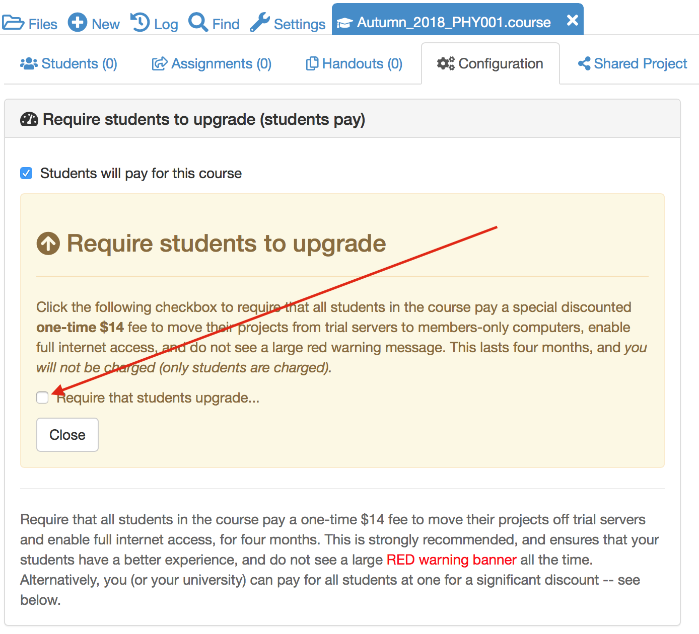
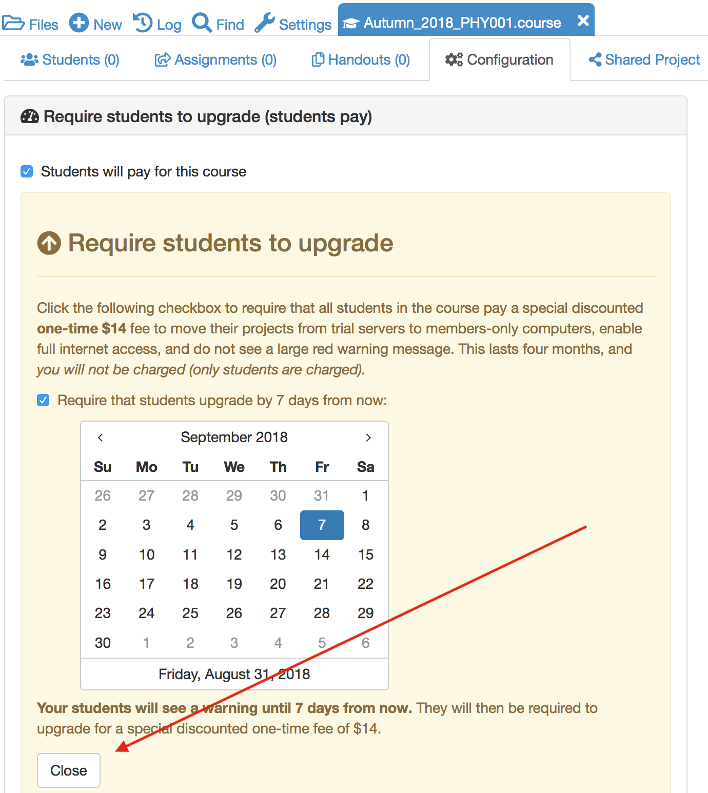
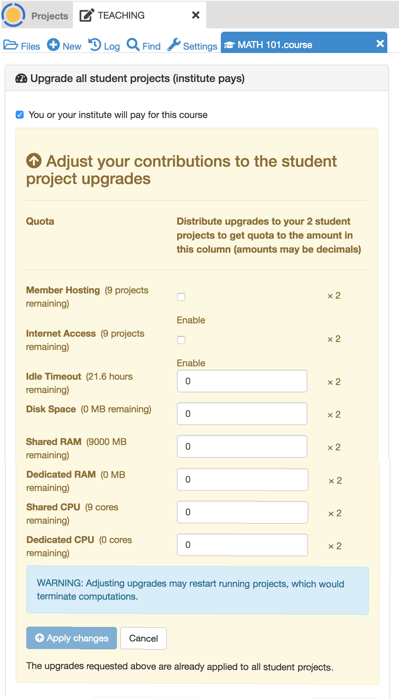
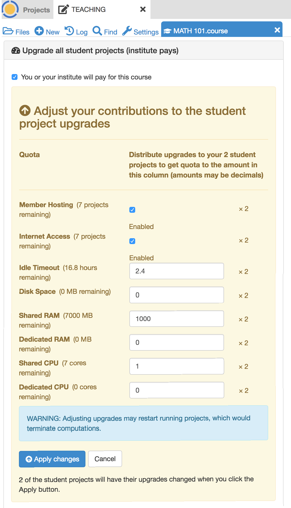
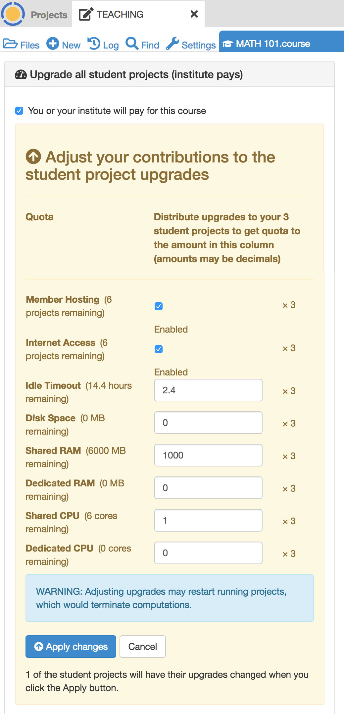
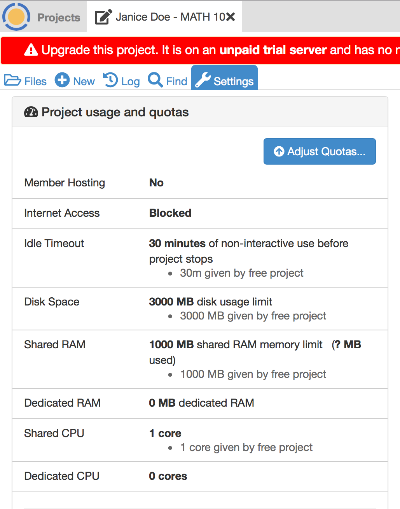
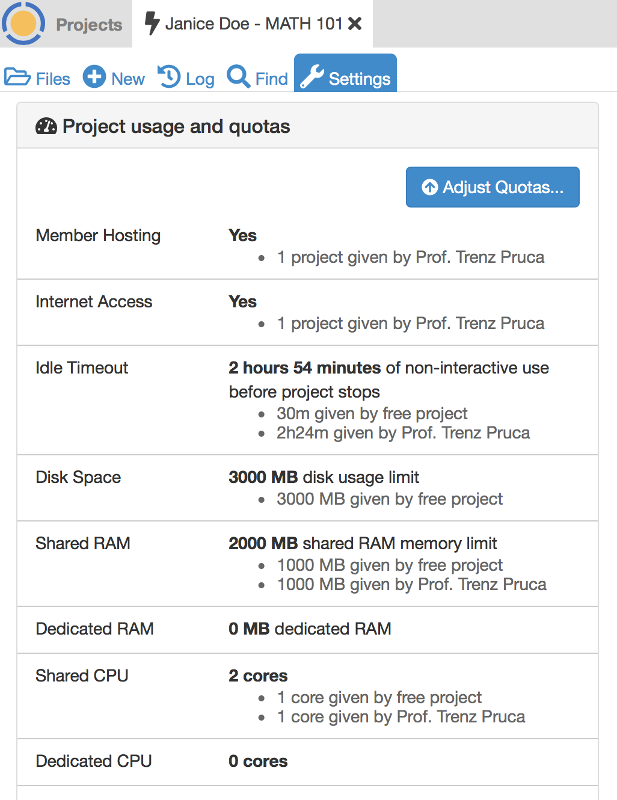

In this section we will learn how to create a course project, how to populate it with a course management file and how to invite all of your students to join the course.

## Creating the course project

In this section we are going to create a project containing a course.

Log into CoCalc and click on the **projects** icon in the top left hand corner of the screen.

Click on **Create New Project**, fill out the **Title** and **Description** and click on **Create Project**

The new project will appear at the top of the project list. Click on its  title to open it.

## Adding teaching assistants to the course

To add teaching assistants or other teachers to the course, open the course project, click on the settings tab and look down to see "Add people to project" in the project settings.

Under **Add people to project**, you can find or add collaborators by name or email address.
These collaborators will also have access to all associated student projects orchestrated by that project.
Do **not** add any students of yours as project collaborators!

If the email address you add as a collaborator is not associated with a CoCalc account,
an email will be sent to that address with instructions how to join.
Once the account with exactly that email address is created, that new user will be added automatically to all projects with pending invitations.

## Creating the course file

Almost all aspects of a course, such as which students are enrolled and assignment management, are controlled by a **.course** file. We'll now create this file.

Open the course project, click on **New** and give the course a title.
Here, I've used `Autumn_2016_PHY001`.
Click on **Manage a Course** to create the course file.

If you go to the root of the course project directory, you will see that a new file has been created with the extension **.course**. This is the course management file and most aspects of your course are controlled by it.

## Adding students to the course

Open your course by clicking on the **.course** file.

In the **Students** tab, add a comma separated list of students' emails addresses in the search box and click on the search icon.

If you have a particular large class, the above method may take a very long time. If you have your students' email addresses in an Excel spreadsheet (or Google Sheet) you can copy and paste them directly in the **Add student** box.

After parsing the list, you can either explicitly the students to add (press shift or ctrl key for multiple selections),
or just click the "Add all students" button.

Next, the student projects will be created. Please be patient until all students are processed and do not close CoCalc.

All added students will be invited to join your course by email.
Any student who does not have an account on CoCalc will be invited to create one.

Your course page will now look like this

* Email addresses that are followed by **(invited)** do not have a CoCalc account yet.
  **(invited)** will disappear as soon as they sign up.
* You can see when each student last used the course project. In this case -- never!
* The **! Free** warning next to each student shows that they are running this course on free servers. It is **strongly** recommended that you upgrade this to members-only servers for your students.  You can also require in the configuration page that your students pay a small one-time fee to upgrade their projects (see below). Read more about how [how to pay for a course](https://github.com/sagemathinc/cocalc/wiki/prof-pay) in the CoCalc Wiki.

## What do the students get?

On being invited to a course, each student will have a project created for them in their CoCalc account that corresponds to that course. Each project will have you and the course Teaching assistants set as collaborators.

The student's course project will have its own individual quotas set for disk storage, internet access and so on (e.g. students get 1GB of RAM). These quotas will be the standard set of quotas that everybody gets with free CoCalc projects.

## Upgrading students: 

The **Configuration** tab of a **.course** file allows you to upgrade students' course projects in two ways, indicated by the checkboxes in the image below:

## Upgrading students (option 1): Students pay

You can request that the students pay a one-time fee of $14 for four months.
This will move their projects to members-only hosts and enable full internet access.

If you click "Students will pay for this course", another checkbox appears, "Require that students upgrade...":

When you check that checkbox, a calendar form opens. The default is to require students to pay within one week, but you can change the deadline. Select a different date if you want, or leave it at the default, and click "Close".

See the [CoCalc wiki page about the student pay option](https://github.com/sagemathinc/cocalc/wiki/student-pay) for additional details on this approach.

## Upgrading students (option 2): Teacher or institution pays

Alternatively, you can pay on your students' behalf.
Current pricing is available at <https://cocalc.com/policies/pricing.html> which at the time of writing ranged from a **total** of about $7 to $14 per student for a 4 month course.
The price per student varies according to the size of the student cohort. You get significant per-student discounts when you buy in bulk.

... and after selecting that [you/your institution pays](https://github.com/sagemathinc/cocalc/wiki/prof-pay),
you can proceed to distribute the upgrades of the course package here:

Clicking "Adjust upgrades..." lets you allocate any available upgrades in your account.

### Entering initial student upgrades

The following screenshots assume the instructor has purchased a One Week Standard Extra Small subscription, with upgrades for 10 projects, and applied upgrades to the TEACHING project, leaving upgrades for 9 student projects.
Two students have been added to the "MATH 101" .course file.

After clicking `Adjust upgrades...` as shown above, this is what the instructor sees:

The instructor enters the usual upgrades *per student* for Standard subscriptions:
- Member Hosting: ✓
- Internet Access: ✓
- Idle Timeout: 2.4 hours
- Shared RAM: 1000 MB
- Shared CPU: 1 core

After checking that everything looks right, the instructor clicks `Apply changes`.

### Adding more student upgrades

Now suppose a third student arrives after the previous upgrades have been applied. The instructor again opens the .course file, selects Configuration, and clicks `Adjust upgrades...`. Note the message at the bottom of the dialog that only one of the student projects will be upgraded.

*Without making any changes to the numbers entered,* the instructor again clicks `Apply changes`. The third student project is now upgraded.

### What the student sees

Here is what a student will see upon opening his/her student project for the course.

First, this is what is seen if the instructor has not yet applied upgrades for the student project. Note the red banner warning that the project is not upgraded.

Second, this is what is seen if the instructor has added typical upgrades for a Standard course. The exact amounts added will vary for different plans. For example, Basic courses include upgrades for Member Hosting and Internet Access, but not for other resources. Note in the Projects toolbar at very top, that the project is restarting. That is because upgrades were applied by the instructor moments ago.

