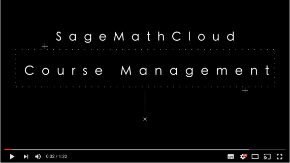

# Creating a course

In this section we are going to create a project containing a course.

* Log into SageMathCloud and click on the **projects** icon in the top left hand corner of the screen.

* Click on **Create New Project**, fill out the **Title** and **Description** and click on **Create Project**

## Exercise idea

Split the class into groups. Mimium size 3 per group.
Get one person to be the instructor -- the other 2+ people, the students.

* Provide example lecture notesbook for them to use.
* Provide example assignment notebook for them to use.

Exercise proceeds by lecturer distributing the materials to the students.

Students work through the lecture notebook and completes the assignment.
Lecturer monitors and comments using the collaborative notebook tools

Lecturer marks the assignment and returns them to students

## Resources

