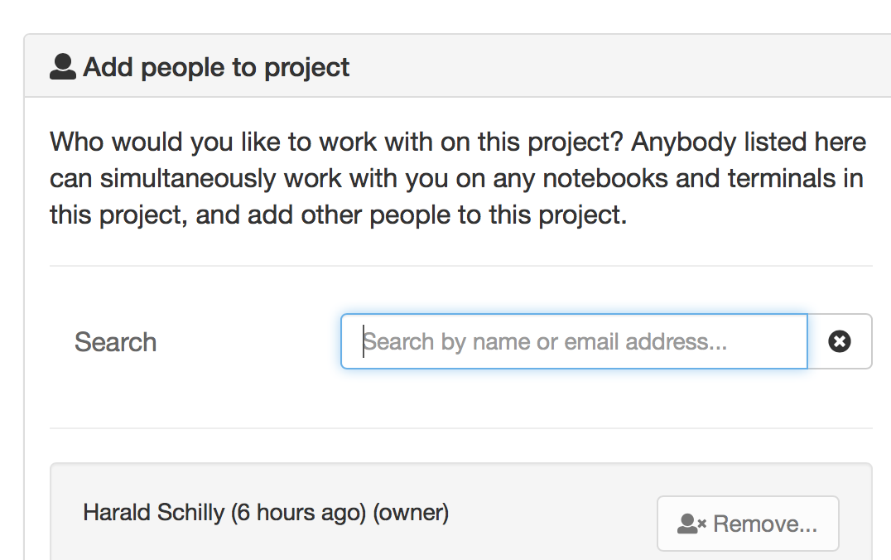
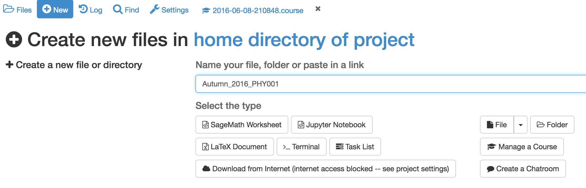
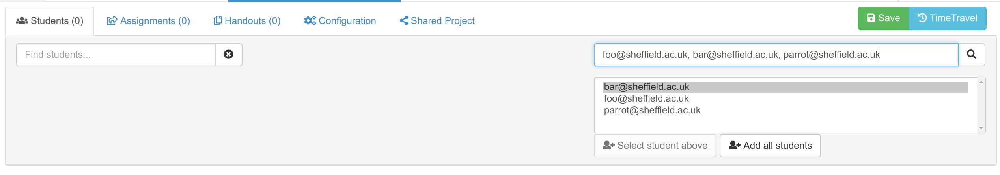

# Creating a new course
In this section we will learn how to create a course project, how to populate it with a course management file and how to invite all of your students to join the course.

## Creating the course project

In this section we are going to create a project containing a course.

Log into SageMathCloud and click on the **projects** icon in the top left hand corner of the screen.

Click on **Create New Project**, fill out the **Title** and **Description** and click on **Create Project**

The new project will appear at the top of the project list. Click on its  title to open it.

## Adding teaching assistants to the course

To add teaching assistants or other teachers to the course, open the course project and click on the **Add Collaborators** icon in the top right hand corner of the screen.

The **Settings and configuration** screen will open. In the **Collaborators** tab, you can find or add collaborators by name or email address.

If the email address you add as a collaborator is not associated with a SageMathCloud account, an email will be sent to that address with an invite to join.
Once the owner of that email address gets an account, the new user will be added automatically to all projects with pending invitations.

## Creating the course file

Almost all aspects of a course, such as which students are enrolled and assignment management, are controlled by a **.course** file. We'll now create this file.

Open the course project, click on **New** and give the course a title. Here, I've used `Autumn_2016_PHY001`. Click on **Manage a Course** to create the course file.

If you go to the root of the course project directory, you will see that a new file has been created with the extension **.course**. This is the course management file and most aspects of your course are controlled by it.

## Adding students to the course

Open your course by clicking on the **.course** file.

In the **Students** tab, add a comma separated list of students in the search box and click on the search icon.

Highlight all of the students in the resulting list and click on **Add N Students** where N is the number of students in your list.

All added students will be invited to join your course by email. Any student who does not have an account on SageMathCloud will be invited to create one.

Your course page will now look like this

* Email addresses that are followed by **(invited)** do not have a SageMathCloud account yet. **(invited)** will disappear as soon as they sign up.
* You can see when each student last used the course project. In this case -- never!
* The **! Free** warning next to each student shows that they are running this course on free servers. It is **strongly** recommended that you upgrade this to members-only servers for your students.  You can also require in the settings page that your students pay a small one-time fee to upgrade their projects (see below).

## What do the students get?

On being invited to a course, each student will have a project created for them in their SageMathCloud account that corresponds to that course. Each project will have you and the course Teaching assistants set as collaborators.

The student's course project will have its own individual quotas set for disk storage, internet access and so on (e.g. students get 1GB of RAM). These quotas will be the standard set of quotas that everybody gets with free SageMathCloud projects.

## Upgrading students

The **Settings** tab of a **.course** file allows you to upgrade student's course projects in two ways.
You can request that the students pay a one-time fee of $9 for four months.
This will move their projects to members only hosts and enable full internet access.

Alternatively, you can pay on your student's behalf.
Current pricing is available at https://cloud.sagemath.com/policies/pricing.html which at the time of writing ranged from a **total** of $4 to $8 per student for a 4 month course.
The price per student varies according to the size of the student cohort. You get significant per-student discounts when you buy in bulk.

