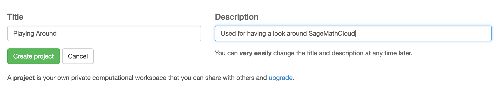
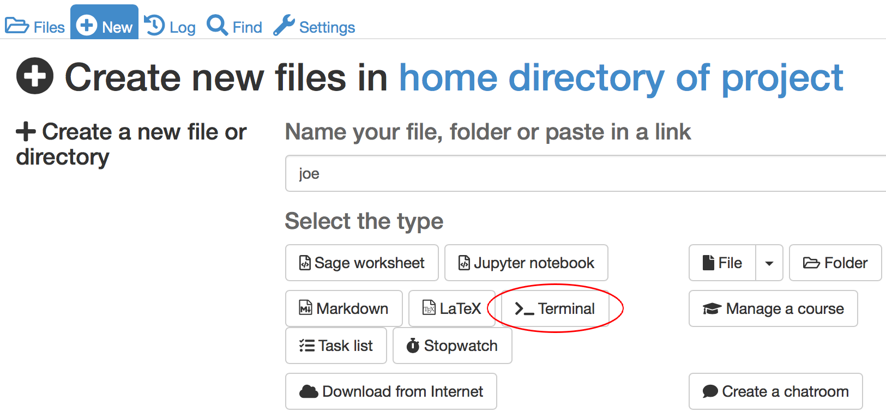

# A tour of SageMathCloud

SageMathCloud contains a lot of functionality including the ability to run Linux terminals, Jupyter Notebooks and Sage Worksheets along with a wide range of course management facilities. 

In this section, we'll take a closer look at some of the features not related to course management. Course management features are described elsewhere in this session.

### Create your first project

Log into SageMathCloud and click on the **projects** icon in the top left hand corner of the screen.

Click on **Create New Project**, fill out the **Title** and **Description** and click on **Create Project**

Once you've created it, click on the project title to open it. It will initially be empty so we'll start creating files

### Linux terminal

SageMathCloud provides full access to the Linux terminal. To open a terminal, click on **New** and give your session a name. I've used `terminal session` in the example. Click on **>_ Terminal** to begin your session

This starts up a traditional looking Bash session

The terminal welcome message gives you an idea of some of the software that's available. A partial list includes

* C, C++ and fortran compilers such as [gcc](https://gcc.gnu.org/) and [clang](http://clang.llvm.org/) and gfortran.
* Mathematical and statistical software such as sage, GNU Octave, R and Gap
* Text editors including vim, emacs, joe and nano
* Programming languages such as julia, ocaml
* The popular alternative to Bash, zsh
* Version control via git
* LateX

The distribution is based on Ubuntu Linux but it is not possible to install software yourself using `apt-get`.

If you need something installed, contact the SageMathCloud team for [some help](#GettingHelp).

When you start a terminal session called `foo`, a file called `foo.term` is created. It's contents are not particularly interesting as they only mean something to the SageMathCloud system. The file is useful, however, in that it can be used to re-open a terminal session at the same place you previously left off. 

### Jupyter Notebooks

TODO - include range of terminals and interactivity.

### Sage Worksheets

TODO

### What can't be done in SageMathCloud?

SageMathCloud does not have any support for X Windows which means that applications that require a GUI cannot be used. This includes things like gedit, Spyder and xclock.

Since SageMathCloud is Linux based, it is not possible to run Windows applications such as Microsoft Word, Powerpoint and Excel.

It is not possible to install commercial software such as MATLAB or Mathematica - only open source software can be used.

### Getting help 

If you need help from the SageMathTeam, you can create a support ticket by emailing help@sagemath.com or clicking on the help icon in the top right hand corner of most SageMathCloud screens.

 
