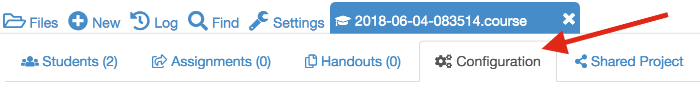
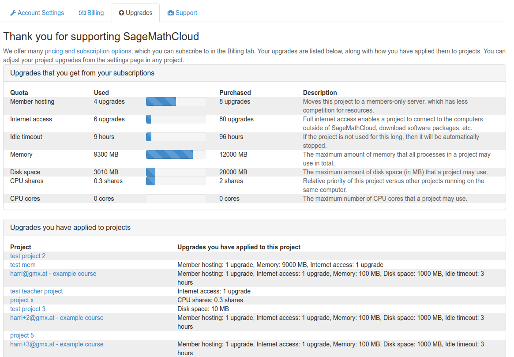

This section introduce you to several functions of CoCalc.

## Lecturers - Sign up for an account

Basic usage of CoCalc is free but before you can start using it, you need to create an account. This can be done at the [CoCalc website](https://cocalc.com/).

It is strongly suggested that you, and your students, sign up using your institutional email addresses.
This makes it much easier to find students in the system.

## Getting your students to sign up

You don't need to worry about getting accounts for your students ahead of time.

Once you've created your course in CoCalc, you just a add list of student email addresses to it. All students immediately get sent a course invite, and when they create an account with that address, they are good to go.

## Upgrades to student projects

CoCalc accounts are free for you and your students and you can create as many projects as you desire.  These basic projects have access to all of CoCalc's functionality with one exception: basic projects are not able to download or upload files to other sites on the internet - you can only upload and download between your computer and CoCalc.  Additionally, basic projects run on free servers which are shared with many other users and rebooted without warning during the day.  You can purchase upgrades for projects that allow internet access and will move the projects to run on members-only servers.

There are two ways students can receive upgrades for their projects:
- Students can pay a \$14/semester fee
- You or someone at your school can purchase a [course package](https://cocalc.com/policies/pricing.html)
    - Course packages provide you with a number of member hosting upgrades and internet access upgrades that you can distribute to students.
    - Read more about how [how to pay for a course](https://github.com/sagemathinc/cocalc/wiki/prof-pay) in the CoCalc Wiki.

**To distribute the project upgrades to the students:**
- The person who purchases the course package needs to be a collaborator on the project that contains your course.
- Open the `.course` file and go to the course  `Configuration` tab (the gears icon between the `Handouts` tab and the `Shared Projects` tab).  

- Under *Upgrade all student projects (institute pays)*,  select `Adjust upgrades...`
- Select the checkbox for **Member hosting** and **Internet access** and click `Submit changes` to distribute these two upgrades to each student's course project.
    - These upgrades only apply to the student course projects and not to any other projects students may have created.

**Screenshot below shows results of distributing upgrades to student projects**

---

If you have purchased a personal subscription and have unused project upgrades, you can share those with your students as well.

Contact [help@sagemath.com](help@sagemath.com) if you have any questions about project upgrades and course packages.
