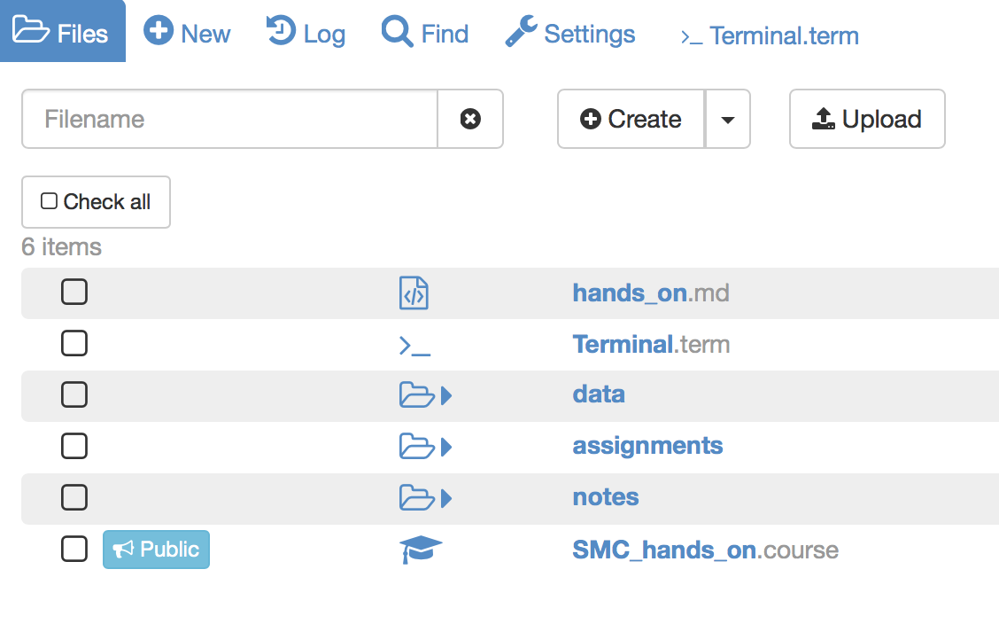

# Getting started
1. If you have not done so, create an account in [SageMathCloud](https://cloud.sagemath.com/) using your institutional email.
2. Log into your SageMathCloud account and create a new project named **SMC_hands_on** and make sure you add a meaningful description.
3. Once you have created your project the next thing to do is create a **.course** file (you can name it SMC_hands_on.course as well).

## Structuring your course
A commonly used structure for SMC courses is as follows:
  - notes
    - week1
  - data
    - data set 1
  - assignments
    - week1
    - week2
  - lab_sessions (if applicable)

(Note this is a suggested basic structure, which has been proved to be useful for some people. You can always add directories to satisfy your needs e.g. supplementary material, demo codes, etc.).

Now let's start populating your course with some content.

If you have Internet access in your SageMathCloud account (upgraded account) follow the next steps:

1. Create a terminal session (**>_Terminal**), you can give it whatever name you want.
2. We have created a GitHub repository for this session, which contains some directories and files to populate your project. In your terminal checkout the repo:

```bash
git clone https://github.com/trallard/SMC_HandsOn.git
```

Once you have done this your project should look something similar to this:



If you don't have internet access you can clone the repository on your personal computer and then drag and drop the files into your SageMathCloud project.

Note that the drag and drop functionality has a size limit so you might need to create your project directories first. You can do this by using the **New** button or typing directly the terminal commands:

```bash
mkdir notes
mkdir notes/week1
```

## Adding people
When you manage a course on SMC you might usually want to add students and collaborators.

The collaborators will more than likely be your demonstrators and any other lecturers in charge of the course. These can be added directly on the settings section of your project (wrench icon).

Students are added directly from the **.course** file in home directory. If you have a very small group you can add these manually, otherwise you can copy the contents of a .xls or .csv file directly on the **Add student by name or email address**.

We'll add "students" to the session: locate the *hands_on.csv* file (*in-person tutorial session only*, sorry) provided by the tutor and add your peers as students.
You can do this by copying and pasting directly on the

As they accept the invitation you will be able to see the students name and email  in your **.course** file. This also provides information on when they last accesses the course.

Once a student has been added to the project they have their own copy of the project.
