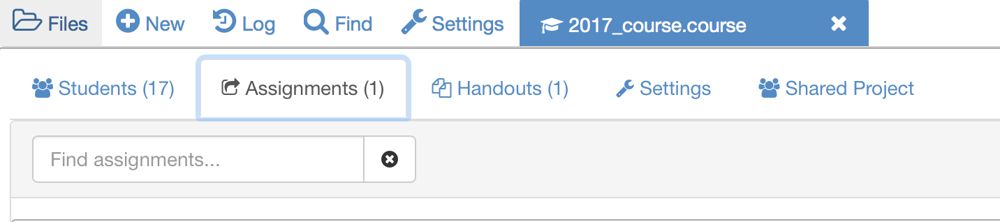

# Assigning coursework to the students
In this section  you will learn how to create assignments and assign them to students.

If you navigate to your `.course` file you should now be able to see the students in your course as well as the following upper banner:

You will notice that you have assignments as well as handouts. Both consist on a folder that contains at least one file to be distributed to your students.

The main difference relies on the actions you and students can perform on the files:

* Handouts: these include the lecture material (notes) and are meant to be accesses by the students at any point during the course

* Assignments: these cover the coursework/projects students will be working on and which you will be collecting and marking

## Creating and assignment
Open the `.course` file and click on the **Assignments** tab. Enter **Assignment1** on the search box on the right hand of the screen.

Once the system locates the folders, click on the relevant option and click on **Add assignment**.

## Assigning to students
Once it has been added to the list of available assignments, click on the assignment and set a **Due** date.

If you want to assign this to the entire class just click on **Assign**, if you want to assign it to only a few students click on the **Assign** button next to the student's name.

## Exercise 1: sharing notes
Share your course notes and the LaTex file you created previously with some of the students you added in the previous sections.

## Exercise 2: assignments
Following the procedure described before choose 1-2 students to assign the material in the Assignments folder.

## Exercise 3: completing assignments
If you have been assigned some coursework by your peers, open the assignment and make some changes (i.e formatting, re wording, changing plots, adding plots)
