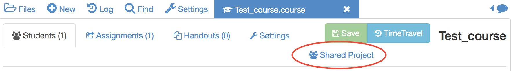
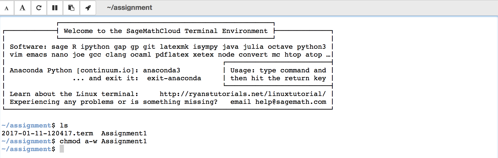

There are multiple ways in which you can interact with your students or collaborators, in this section we will present some features that you might find useful when managing a course.

## Real-time chatrooms
You can create general real-time chatrooms for your CoCalc projects.
You can create a project chat room by clicking on the **New** button, this will create a file with `.sage-chat` extension.

In addition, every file in CoCalc has a separate chat that can be found on the upper left corner of your screen.

Every time one of your students writes something into a chat on any one of their files,
you will get a notification displayed on the top bar.

Clicking on the notification button (bell icon on the top of the screen) displays a notification menu with the latest chats and modifications in the project or specific files.

The chat notifications are always presented at the top of the menu, followed by any updates you or your collaborators have done to the project. Clicking on a chat notification will take you to **the student's copy** of the file inside **his/her project**.
From there, you can both reply to their questions and look at their work simultaneously.

Once you have replied to the student's question (s)he will receive a notification.

## Live collaborative editing
Multiple users can collaborate on a project.
As soon as a collaborator is added to a a project (see [Creating a Course](./creating_a_course/creating_course.md)) they share both the project and the associated files.

Live collaborative editing is possible in CoCalc.
If one of your collaborators updates a notebook, the rest can see the changes as they are being made (similar to Google Docs).

## Creating a shared project
You can create a common shared project for your course. Think of a shared project as your private course website for the students with automatic forum and code support. By default everybody (collaborators and students) will have **write** access to the project and its associated files.

To create a shared project you need to go to your **.course** file and click on the **Shared Project** button.

If you create a **.sage-chat** file here, all students will receive automatic notifications when questions are posted on the chat.

If you want to make a file or an assignment **read only** so that students cannot modify it, you need to modify the file permissions. Launch a terminal and type `chmod a-w filename` (in this example the filename is `Assignment1`).

If you want to check the access permissions of all the files contained in a given directory, use the command `ls -l` on the terminal.

In the case you want to change a read only file into a read and write, type `chmod a+w filename` on the terminal.

## Group Projects
There are various ways in which you can facilitate students' group projects in CoCalc.
A couple of options are:

### *One project per team*
Have someone in each group make a project with all the group members as collaborators.
They will all then be able to collaborate on the same project and modify files simultaneously.

You should note, however, that by using this approach you cannot automatically collect assignments from the team. A workaround could be creating an assignment in your main project and having the students copy that file to their group project.

### *Using Git*
Students can collaborate from within their individual course projects using git via the terminal in CoCalc. See "Using Git" in this tutorial in [Other useful features and tricks](../tips_and_tricks/tips_and_tricks.html).
