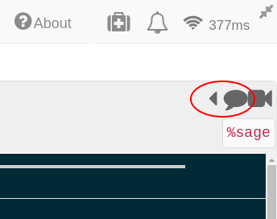
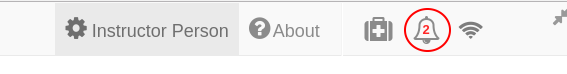
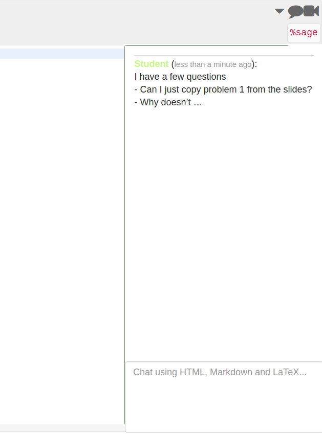
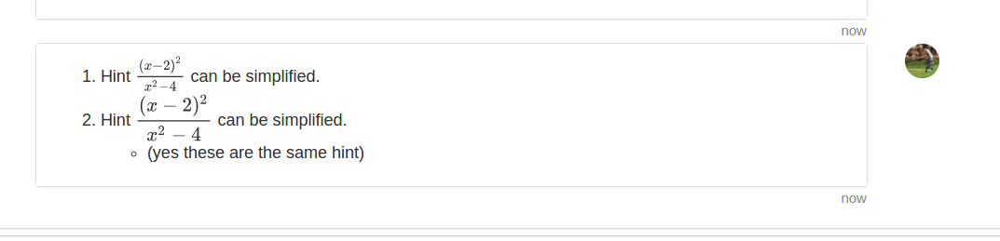

# Tips and Tricks
Here are some things to know that can make your life easier.

## Chat and helping students
Every file in SMC has chat available on the upper right side of the screen.

Every time one of your students writes something into a chat on any one of their files, you get a little notification.

Click...

Clicking on this notification will bring you to **their copy** of the assignment  inside **their project**.
From here, you can reply to their question and look at their work simultaneously.

## Using the shared project
You can think of the shared project to be like your private course website for the students with automatic forum and code support.
If you create a .sage-chat file here, all students will get notifications when someone asks something here.
![example image]

If you want to upload the assignment here, you can make it read only so that students can't change it.
![read only example]

Every time you update the assignment, you can give the students a notification by typing something into the chat in that copy of the assignment
![updated assignment example]

Students can also ask questions and share code snippets here since by default everyone has write privileges to the project.

## Group Projects
There are a few ways to facilitate group projects on SMC.

### One project per team
Have someone on each group make a project with all the group members as collaborators.
They can then all edit the same document(s) together in real time much like Google Docs.
This method has the downside that you cannot automatically collect anything from their project.

### As an assignment
To fix the

### Using Git
Since it supports the terminal, students can also collaborate using git if you desire them to use it.

## Text fields generally support markdown and LaTeX
For example in chat:

**Renders as**

Specifically, it supports [GitHub Flavored Markdown](https://github.com/adam-p/markdown-here/wiki/Markdown-Cheatsheet)

## Making multiple assignment folders quickly
For extremely fast folder creation, you can make a shell script in the language of your choice since SMC gives you terminal access.

However, you can also do this in another way that is still faster than going to  every time.
In the files menu of your project, you can enter text like `assignments/assignment1/directionts.md` and hit **enter** or **ctrl+enter** to create `directions.md` inside the folder `assignment1` which will be inside `assignments`. **enter** will open up that file while **ctrl+enter** will silently create the necessary files and folders.

-- Example of above process with images --

![some images]

You can also create folders here just by ending with a `/`

![image of folder creation]

