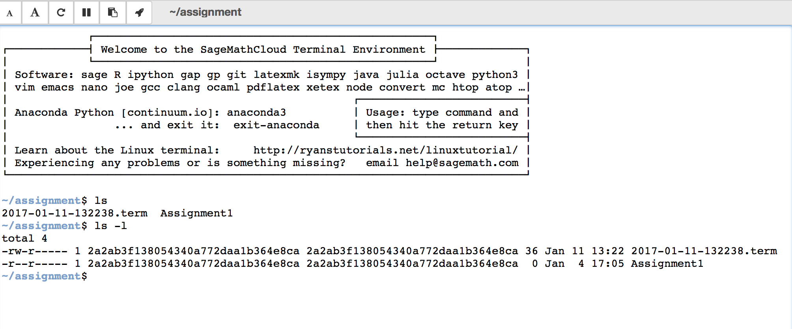

# Interacting with students
There are multiple ways in which you can interact with your students or collaborators, in this section we will present some features that you might find useful when managing a course.

## Real-time chatrooms
You can create general real-time chat rooms associated to a given project. All the people associated to the project will have access to the chat.

In addition, every file in SMC has a separate chat that can be found on the upper left corner of your screen.

Every time one of your students writes something into a chat on any one of their files, you will get a notification displayed on the top bar.

When clicking on the notification icon a menu containing the latest updates and chats will be displayed.

The chats are always presented at the top of the notification menu, followed by any updates/additions you or your collaborators have done to the project. Clicking on a chat notification will take you to **the student's copy** of the file inside **his/her project**.
From there, you can both reply to their questions and look at their work simultaneously.

Once you have replied to the student's question (s)he will receive a notification.

## Live collaborative editing
Multiple users can collaborate on a project. As soon as a collaborator is added to a a project (see [Creating a Course](./creating_a_course/creating_course.md)) they share both the project and the associated files.

Live collaborative editing is possible in SMC. If one of your collaborators updates a notebook, the rest can see the changes as they are being made.

## Creating a shared project
You can create a common shared project from any of your existing projects. By default everybody (collaborators and students) will have **write** access to the project and the files contained in it.

You can think of a shared project to be your private course website for the students with automatic forum and code support.

To create a shared project you need to go to your .course file and click on the **shared project** icon. 

If you create a .sage-chat file here, all students will receive automatic notifications when questions are posted on the chat.

If you want to make a file or an assignment read only so that students cannot modify it you can change the file access permissions.

To do so, launch a terminal and type `chmod a-w filename`.

If you want to check the access permissions of all the files contained in a given directory use the command `ls -l` on the terminal.

If you want to change a file from read only to read and write type `chmod a+w filename` on the terminal.

## Group Projects
There are a few ways to facilitate group projects on SMC.

### One project per team
Have someone on each group make a project with all the group members as collaborators.
They can then all edit the same document(s) together in real time much like Google Docs.
This method has the downside that you cannot automatically collect anything from their project.

However, you can definitely make an assignment and just make them copy the files over from their group project.

### Using Git
Since it supports the terminal, students can also collaborate using git right in their own course-affiliated project.

## Text fields generally support markdown and LaTeX
For example in chat:

**Renders as**

Specifically, it supports [GitHub Flavored Markdown](https://github.com/adam-p/markdown-here/wiki/Markdown-Cheatsheet)

## Making multiple assignment folders quickly
For extremely fast folder creation, you can make a shell script in the language of your choice since SMC gives you terminal access.

However, you can also do this in another way that is still faster than going to  every time.

In the files menu of your project, you can enter text like `assignments/assignment1/directions.md` then hit **enter** or **ctrl+enter** to create `directions.md` inside the folder `assignment1` which will be inside `assignments`. Hitting **enter** will open up the new file while **ctrl+enter** will silently create the necessary files and folders in the path.

You can also create folders here just by ending with a `/`

## Starting up everyone's project before class
By default, projects have a idle time of 24 hours before they spin down and need to be started again.
Inside your course manager, you can start everyone's project so that they are all "hot loaded". 
This can be useful to do before class or presentations.

First, make sure you are in your course settings and not your project settings.

Then scroll down to find and click on the `Start all...` button

